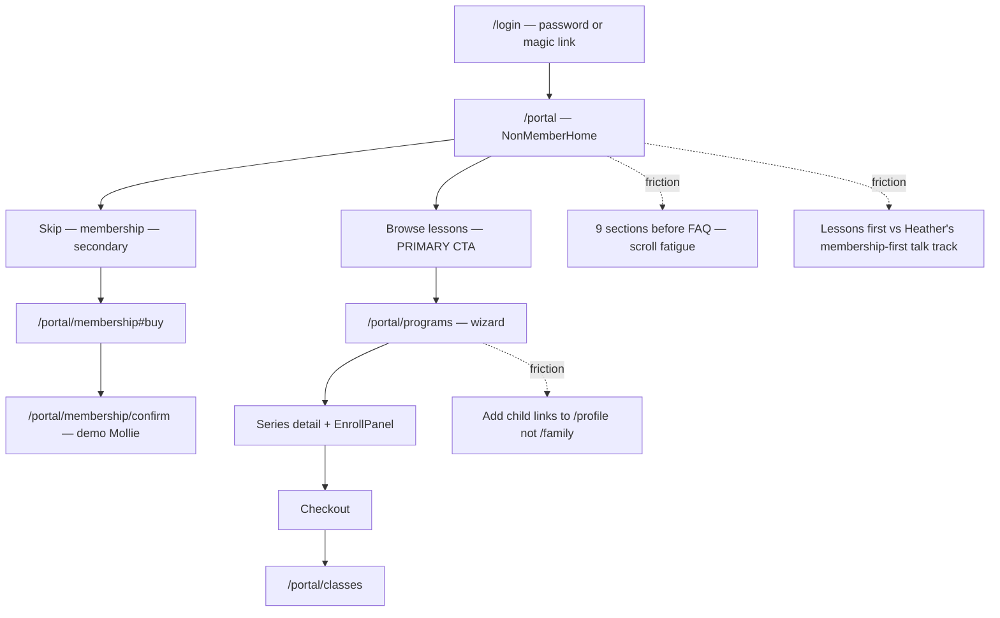
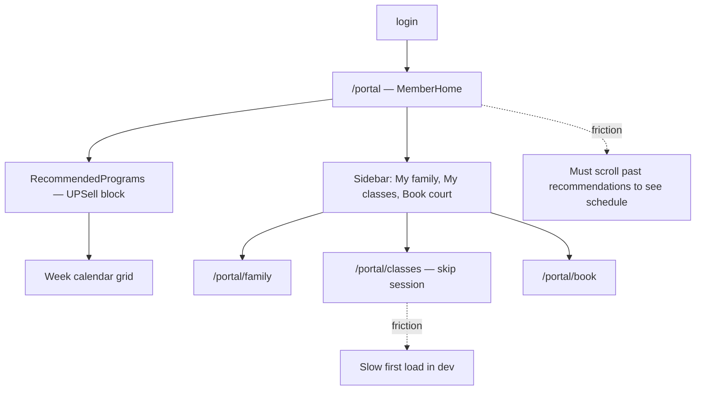
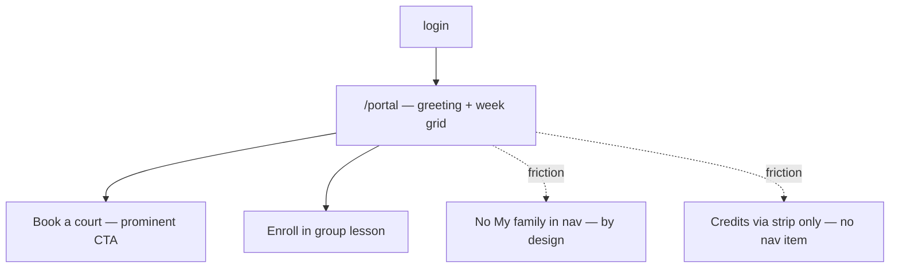
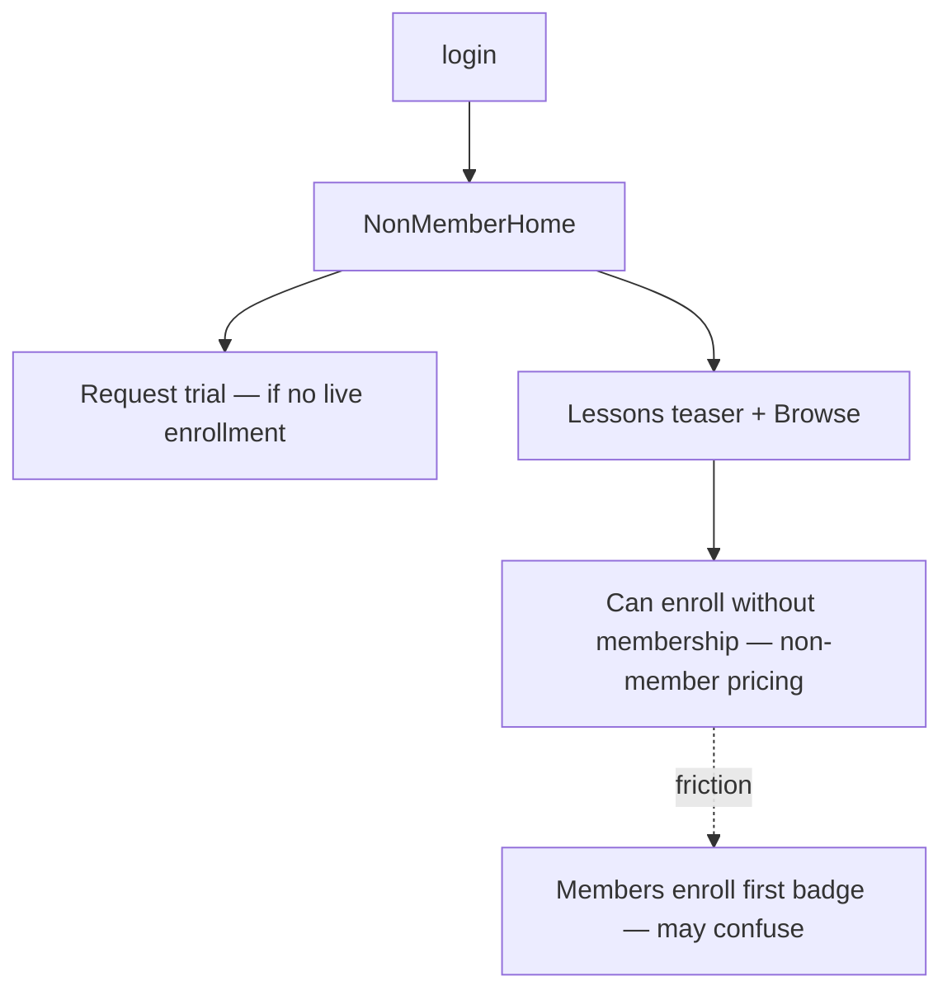
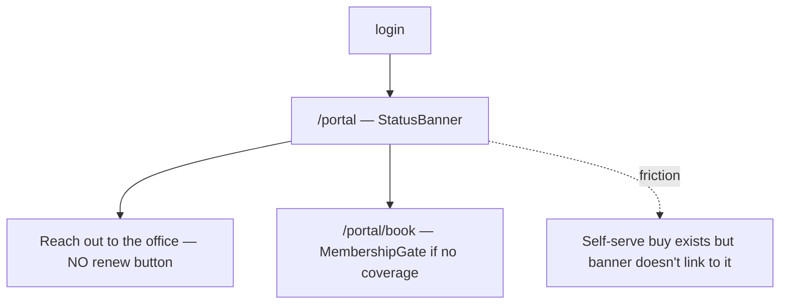

# Members Portal UX/UI Audit

**Date:** 25 June 2026  
**Environment:** Local dev (`http://localhost:3000`), tenant **Higgins NL** (`higgins-nl` — Triaz + Randwijck)  
**Method:** Code review + authenticated route probes + complaint corpus cross-reference  
**Screenshots:** 11 desktop screenshots (Noah Cladera, non-member, Higgins NL localhost) — see [Screenshot gallery](#screenshot-gallery-desktop-25-jun-2026).

---

## Executive summary

The Higgins members portal is a thoughtfully designed product with a coherent **Layered Paper** visual system, persona-aware navigation, and a deliberate split between **non-member sales home** and **member utility home**. The core architecture is sound.

However, several issues will drive office email volume and parent frustration at launch unless addressed:

### Top 5 issues (fix first)

| # | Issue | Severity | Impact |
|---|-------|----------|--------|
| 1 | **Slow cold loads on key pages** — `/portal/classes`, `/portal/book`, `/portal/family` exceeded 25s on first request in dev (warm loads ~2.4s). Parents may abandon mid-flow. | Major | All personas |
| 2 | **Returning member home buries the schedule** — `RecommendedPrograms` renders *above* the week calendar on `/portal`. Active members must scroll past upsell to see what's on today. | Major | Returning parent, adult member |
| 3 | **Expired membership dead-end** — Banner says "Reach out to the office to renew" with no self-serve CTA to `/portal/membership#buy`, despite self-serve purchase existing elsewhere. | Major | Expiring member |
| 4 | **Inconsistent "add child" paths** — FAQ and family pitch link to `/portal/profile`; family management lives at `/portal/family`. Nav only shows "My family" when children already exist. | Major | New parent |
| 5 | **Dual primary nav highlights** — Non-members see both "Request trial" and "Get a membership" with green primary emphasis; unclear which is the next step. | Major | Non-member |

### Top 5 strengths

| # | Strength |
|---|----------|
| 1 | **Persona-split home** — Non-members never see empty calendar grids; member home combines week view, household, and memberships in one place. |
| 2 | **Dynamic sidebar** — Nav adapts to membership, children, enrollments, and feature flags (`nav-sections.ts`). Non-members get "Get started" group with primary membership CTA. |
| 3 | **Club-branded design system** — Triaz / Randwijck / joint tokens applied consistently on buttons, badges, membership cards, and avatars. |
| 4 | **Enrollment transparency** — Programs page shows proration messaging upfront; enroll panel surfaces price breakdown, waitlist, and member vs non-member tiers. |
| 5 | **Skip-session flow** — "Can't make it" on My Classes notifies coach with undo support; addresses rain/absence complaint theme partially. |

---

## Test environment

| Item | Value |
|------|-------|
| Server | `npm run dev` on port 3000 |
| Seed | `npm run db:seed-examples` (fixed schema drift during audit) |
| Password | `higgins-test` for all `.test` accounts |
| Org | `higgins-nl` (default localhost) — NL clubs, EUR, after-school preset |

### Seed personas used

| Email | Persona | Membership | Children |
|-------|---------|------------|----------|
| `adult.example@higginstennisnl.test` | Adult solo student | Adult joint (Triaz + Randwijck) | 0 |
| `parent.multi.example@higginstennisnl.test` | Returning parent | Family Triaz | 3 |
| `parent.single.example@higginstennisnl.test` | Two-parent household | Family joint | 1 |
| Fresh signup | Not executed (would create throwaway auth user) | — | — |

---

## Functionality test matrix (flows A–M)

| Flow | Description | Result | Notes |
|------|-------------|--------|-------|
| **A** | New signup → profile complete | **Skip** | Signup page loads (client-rendered path picker); full signup not executed to avoid polluting DB |
| **B** | Buy membership (adult Triaz) | **Pass** | `/portal/membership` and `#buy` anchor load; demo Mollie checkout available |
| **C** | Buy joint membership | **Pass** | Pricing strip on non-member home links to `?coverage=joint#buy` |
| **D** | Enroll adult in group lesson | **Partial** | Programs catalog loads (7.4s cold); series detail not probed; no test enrollment executed |
| **E** | Enroll child (school pickup) | **Partial** | Parent programs load; family/classes pages slow on cold start |
| **F** | Add child to household | **Partial** | Profile loads; `/portal/family` 25s timeout cold, 2.2s warm; FAQ links to profile not family |
| **G** | Book court + partner search | **Pass (E2E)** | Link-first club/court/slot; native booking sheet; `mobile-book.spec.ts` |
| **H** | Skip session / makeup | **Pass (code)** | `SkipSessionButton` notifies coach; makeup request flow exists in attendance actions |
| **I** | Transfer class | **Pass (code)** | `/portal/classes/[id]/transfer` form present; not live-tested |
| **J** | Cancel membership | **Pass (code)** | Cancellation request → admin queue; refunds still office-handled per FAQ |
| **K** | Calendar sync | **Pass (E2E)** | Add to calendar Link-first sheet; `mobile-calendar.spec.ts` |
| **L** | Inbox notifications | **Pass** | Inbox loads (~2.2s); `mobile-account.spec.ts` |
| **M** | Expired membership state | **Pass (code)** | Banner includes self-serve renew CTA → `/portal/membership#buy` |

Raw probe data: [`_portal-test-results.json`](./_portal-test-results.json)

### Performance note

First authenticated request to `/portal/classes`, `/portal/book`, and `/portal/family` **timed out at 25s** during initial probe (Next.js dev compilation). After warm-up, same routes returned **200 in ~2.2–2.4s**. Recommend:

- Load-test production build (`npm run build && npm start`)
- Add `loading.tsx` skeletons (partially present) and verify they render during slow queries
- Profile DB queries on classes/book/family pages

---

## Persona journey maps

### 1. New parent (no membership)

### 2. Returning parent (membership + enrolled kids)

### 3. Adult solo member

### 4. Non-member browsing lessons

### 5. Expiring / expired member

---

## Findings table

| ID | Severity | Area | Persona | Finding | Evidence | Complaint link | Recommendation | Status |
|----|----------|------|---------|---------|----------|----------------|----------------|--------|
| F-01 | **Blocker** | Performance | All | Cold dev loads on classes/book/family exceed 25s | Probe timeouts; warm ~2.4s | Registration friction | Profile production build; optimize queries; verify loading skeletons | Done (skeletons) |
| F-02 | **Major** | IA / Home | Returning member | RecommendedPrograms above week calendar | `page.tsx:368` | — | Move calendar above recommendations for members with upcoming sessions | Done |
| F-03 | **Major** | Membership | Expiring | Expired banner directs to office, not self-serve renew | `page.tsx:416-428` | Membership confusion (12k emails) | Add "Renew now" button → `/portal/membership#buy` | Done |
| F-04 | **Major** | IA | New parent | "Add a child" links to `/portal/profile` in FAQ/FamilyPitch | `non-member-home.tsx:519-524, 422-424` | — | Unify on `/portal/family?addChild=1` | Done |
| F-05 | **Major** | Conversion | Non-member | Lessons-first CTA vs membership-first demo script | `non-member-home.tsx:103-111` vs `demo-script-10min.md` | — | **Product decision (25 Jun 2026): keep lessons-first** | Won't fix |
| F-06 | **Major** | Trust | All | FAQ: "Refunds — talk to the office" | `non-member-home.tsx:530-531` | Refunds (5k), invoices (11k) | Improve payments empty state + link to self-serve buy | Done |
| F-07 | **Major** | Onboarding | Returning NL members | Fresh-start requires new account signup | Apr 22 meeting notes | Duplicate accounts (55), re-registration | Migration comms + "link existing household" flow or import wizard | Deferred |
| F-08 | **Minor** | IA | Solo adult | No "My family" nav until children exist | `nav-sections.ts:142-148` | — | Add subtle profile/family entry for "planning to add kids" | Open |
| F-09 | **Minor** | IA | All | Credits visible in strip but no nav item | `nav-sections.ts:38-41` | — | Show nav item when balance > 0 only | Done |
| F-10 | **Minor** | Enrollment | Enrolled parent | WhatsApp group only visible after enrollment | `series page.tsx:332-346` | Apr 22 meeting request | Post-enrollment inbox message with WhatsApp link | Done |
| F-11 | **Minor** | Shell | All | `/levels` uses different app shell than portal | `levels/` routes | — | Wrap levels in portal shell or clear "back to portal" breadcrumb | Deferred |
| F-12 | **Minor** | Signup | New user | Signup is multi-step client form; "Sign up" / "household" not in initial HTML | Probe partial | — | SSR kicker on signup for SEO and perceived speed | Open |
| F-13 | **Polish** | Visual | Non-member | Non-member home is 9 sections / very long scroll | `non-member-home.tsx` | — | Collapse FAQ + tighten spacing; joint upsell reorder | Done |
| F-14 | **Polish** | Copy | Non-member | "Skip — I just want a membership" feels dismissive | `non-member-home.tsx:109` | — | Rephrase: "Membership only" | Done |
| F-15 | **Polish** | A11y | Mobile | Dark mode OS-only; club-soft backgrounds untested | `globals.css` | — | Audit contrast on `--triaz-soft` / `--randwijck-soft` in dark mode | Open |
| F-16 | **Polish** | Motion | Member home | Week pager uses snappy transitions; good | `page.tsx:331-357` | — | Keep; extend to mobile drawer | — |
| F-17 | **Major** | Enrollment | Parent | EnrollPanel ~1300 lines — high cognitive load | `_enroll-panel.tsx` | Registration friction | User test multi-child enrollment; simplify stepper | Deferred |
| F-18 | **Minor** | Booking | Member | Triaz requires partner search — not probed live | `demo-script-10min.md` | — | Verify partner UX on mobile in production build | Open |
| S-01 | **Major** | Nav | Non-member | Two competing primary nav highlights (trial + membership) | Desktop screenshots | — | Single primary: trial if eligible, else membership | Done |
| S-02 | **Major** | Overview | Non-member | 4+ viewport scrolls before FAQ ends | Desktop screenshots | — | Collapse FAQ; tighten section spacing | Done |
| S-03 | **Minor** | Overview | Non-member | Joint upsell buried below individual club CTAs | Desktop screenshots | — | Move JointCrossSell above club tiles | Done |
| S-04 | **Minor** | Overview | Non-member | Price-card "See it →" weaker than club tile buttons | Desktop screenshots | — | Upgrade to outline buttons | Done |
| S-05 | **Major** | Overview | Non-member | Add-a-child links to profile, not family dialog | Desktop screenshots | F-04 | Unify on `/portal/family?addChild=1` | Done |
| S-06 | **Major** | Enrolment | Non-member | Duplicate audience tiles in promo strip + browse wizard | Desktop screenshots | — | Dedupe step-1 wizard when promo shown | Done |
| S-07 | **—** | Enrolment | Non-member | Locked youth tiles with add-child link — clear pattern | Desktop screenshots | — | Keep; reduce repetition elsewhere | — |
| S-08 | **Major** | Membership | Non-member | Encyclopedic page before checkout | Desktop screenshots | — | Buy menu first; collapsible explainers | Done |
| S-09 | **Minor** | Membership | Non-member | "Skip to checkout" easy to miss | Desktop screenshots | — | Promote to PageHeader button | Done |
| S-10 | **Minor** | Inbox | Non-member | Coach deletion request visible (admin template leak) | Desktop screenshots | — | Filter admin-only templates from portal inbox | Done |
| S-11 | **Minor** | Payments | Non-member | Empty state reinforces office dependency | Desktop screenshots | F-06 | Link to membership checkout in empty state | Done |
| S-12 | **Polish** | Identity | Non-member | "Choose a membership →" could link to `#buy` | Desktop screenshots | — | Subline links to `/portal/membership#buy` | Done |

---

## Visual and stylistic review

### Design system: Layered Paper

**Tokens** (`globals.css`): Warm paper background (`oklch(0.985 0.005 85)`), crisp white cards, soft bordered panels. Club colors are distinct and well-named:

- **Triaz** — emerald (`--triaz`, `--triaz-soft`, `--triaz-ink`)
- **Randwijck** — clay orange (`--randwijck`, …)
- **Joint** — purple (`--joint`, …)

**Typography:** `font-display` for headlines (price anchors, family pitch). Editorial spacing (`space-y-10`, `space-y-12`) creates breathing room on desktop; may feel long on mobile.

**Components:** Consistent use of `PageHeader` (kicker → title → description), `Section`, `MetricStrip`, `EmptyState`. Empty week copy ("A wide-open week") is warm and actionable.

### Visual hierarchy observations

| Screen | What works | What to improve |
|--------|------------|-----------------|
| Non-member home | Strong price anchor strip; club tiles with marketing images; "Best value" joint badge | Hero headline long; primary/secondary CTAs equal weight on mobile |
| Member home | Metric strip gives at-a-glance stats; membership cards with club color border | Recommendations block disrupts scan path to calendar |
| Programs | Audience promo tiles; wizard steps | Wizard state in URL params — back button behavior untested |
| Membership | Season strip; coverage explainer; buy menu | Dense on mobile when multiple tiers |
| Login | Clean card; password/magic toggle | Brand logo optional — verify NL logo uploaded |

### Mobile / responsive

- **AppShell** collapses to sticky top bar + drawer at `< md` (`app-shell.tsx`)
- Sidebar nav groups ("Play", "Account") preserve structure in drawer
- Touch targets on week grid events not verified without device screenshots
- Scroll-snap on main content (`snap-y snap-proximity`) — may conflict with long non-member home scroll

---

## NL office email analysis (25 Jun 2026)

Full scan of **71,689 messages** from `higginstennisnloffice@gmail.com` ([`scripts/analyze-nl-email-corpus.py`](../../scripts/analyze-nl-email-corpus.py)). **24,013** parent-themed inbound messages; **820** website contact-form alerts.

| Rank | Theme (NL) | Hits | Portal route | Readiness |
|------|------------|------|--------------|-----------|
| 1 | Schedule, holidays & timing | 11,731 | `/portal/classes` | Medium |
| 2 | Rain, cancellations & makeups | 8,385 | `/portal/inbox` | Medium |
| 3 | Payments, invoices & refunds | 8,271 | `/portal/payments` | High |
| 4 | Registration, waitlist & camp | 8,133 | `/portal/programs` | High |
| 5 | Lesson availability | 5,650 | `/get-started` | High |
| 6 | Court access & ladder | 3,705 | `/portal/book` | Medium |
| 7 | Medals & progress | 3,528 | `/portal/classes` | Medium |
| 8 | WhatsApp / missed messages | 1,674 | `/portal/inbox` | Medium |
| 9 | Membership renewals | 1,077 | `/portal/membership#buy` | High |

Artifacts: [`_nl-email-themes.json`](./_nl-email-themes.json), [`_nl-deflection-scorecard.json`](./_nl-deflection-scorecard.json), [`_nl-quote-bank.json`](./_nl-quote-bank.json).

### Portal changes shipped from this analysis

| Target | Change |
|--------|--------|
| Membership + credits | `CreditStrip` on `/portal/membership`; renew CTA on expired banner (F-03) |
| Contact-form deflection | Public [`/get-started`](../../src/app/get-started/page.tsx); FAQ links on non-member home |
| Cancellation / inbox parity | `cancelSession` notifies families (`class.session.cancelled`); My Classes banner → inbox |

---

## Complaint corpus cross-reference

### Theme frequency (office mail, keyword scan)

| Theme | Approx. mentions |
|-------|------------------|
| Membership | 12,473 |
| Invoice | 11,120 |
| Register | 10,676 |
| Cancel | 8,289 |
| GoTimmy | 7,219 |
| Makeup | 6,610 |
| Rain | 5,518 |
| Refund | 4,997 |

Source: [`brain/data/mail/messages.jsonl`](../../brain/data/mail/messages.jsonl)

### Representative member language (Bernhardt dossier — 21 flagged threads)

- *"Makeup for missed class. Can you do it?"* (2022)
- *"Invoice for Activities Registration"* (2024)
- *"Register now for spring"* / payment receipt threads (2025)
- *"Welcome to Summer Camp! and join the whatsapp chat"* (2025)
- *"Registration for spring/summer starts next Thursday"* (2026)

Source: [`brain/reports/dossier-bernhardt.md`](../../brain/reports/dossier-bernhardt.md)

### Complaint → portal capability map

| Complaint theme | Portal today | Gap |
|-----------------|--------------|-----|
| Refunds / billing errors | Payments history; FAQ links to payments/inbox | No refund status or request tracking |
| Late invoices | Payments page | No proactive invoice delivery / email preference |
| Membership confusion | Membership page + home cards; credit strip on membership | Renew CTA shipped (F-03); renovation credit visibility via credits ledger |
| Registration friction | Programs wizard + enroll panel; `/get-started` for contact-form traffic | Complex; cold loads; GoTimmy muscle memory |
| Re-registration / duplicates | Fresh signup | No legacy account linking |
| WhatsApp groups | Series page post-enrollment; inbox for cancellations | Post-enroll inbox link shipped (F-10); rain cancel now hits inbox |
| Rain-outs / makeups | Skip session → coach notify; session cancel → member inbox | No explicit makeup booking flow visible to parent |
| Coach absence | Not member-facing | Out of scope but erodes trust |

### Stakeholder expectations (Apr 22 walkthrough)

- Replace SuperSaaS, GoTimmy, Google Calendar ✓ (architecture ready)
- Household management for parents ✓
- Automatic proration ✓
- Cancellation request → admin ✓
- WhatsApp on enrollment — **partial** (post-enroll only)
- Self-serve renewals via Mollie — **in progress** (demo checkout works)
- Heather's wish-list email — **not found** in repo

---

## Prioritized backlog

### Quick wins (1–3 days)

1. **F-03** — Add "Renew now" CTA to expired/expiring membership banner
2. **F-04** — Fix add-child links to `/portal/family?addChild=1`
3. **F-10** — Include WhatsApp link in post-enrollment inbox notification
4. **F-14** — Rephrase "Skip — I just want a membership" button copy
5. **F-09** — Show credits nav item when balance > 0

### Medium (1–2 weeks)

1. **F-02** — Reorder member home: calendar before recommendations (when sessions exist)
2. **F-01** — Performance audit on classes/book/family queries; production build benchmark
3. **F-06** — Payment page: show refund/cancellation request status
4. **F-13** — Collapse non-member home sections; sticky mobile CTA bar
5. **F-17** — EnrollPanel UX simplification for multi-child households
6. **F-05** — Align onboarding CTA order with Heather after user test

### Strategic (launch-critical)

1. **F-07** — Legacy member migration / account linking strategy + comms
2. **F-06** — Self-serve refund workflow (even if approval remains manual)
3. **Makeup flow** — Visible parent path from skip session to makeup credit/booking
4. **Production payment** — Real Mollie keys + webhook testing (per demo script)
5. **Mobile device testing** — Real iOS/Android pass with screenshots for regression baseline

---

## Open questions for Heather / William

1. **Onboarding order:** Should new parents buy membership first or browse lessons first? Current UI disagrees with the 10-min demo script.
2. **Expired membership:** Can members self-serve renew online, or must they contact the office for NL policy reasons?
3. **Refund policy:** What can be self-serve vs office-only? Parents will expect visibility after paying online.
4. **WhatsApp:** Should the group link appear immediately after enrollment (inbox + email), or only on series detail for enrolled families?
5. **Legacy data:** What message do existing GoTimmy members receive about creating a new portal account?
6. **Heather's wish-list:** The Apr 22 meeting referenced a pending email with prices, exclusions, and Trias structure — still needed for parity check.

---

## Artifacts produced

| File | Purpose |
|------|---------|
| [`members-portal-ux-audit.md`](./members-portal-ux-audit.md) | This document |
| [`_portal-test-results.json`](./_portal-test-results.json) | Automated route probe results |
| [`_complaint-quotes.json`](./_complaint-quotes.json) | Mail corpus theme counts (CA + NL office summary) |
| [`_nl-email-themes.json`](./_nl-email-themes.json) | Full NL office theme counts & top subjects |
| [`_nl-deflection-scorecard.json`](./_nl-deflection-scorecard.json) | NL deflection priority scorecard |
| [`_nl-quote-bank.json`](./_nl-quote-bank.json) | Verbatim NL parent quotes by theme |
| [`scripts/analyze-nl-email-corpus.py`](../../scripts/analyze-nl-email-corpus.py) | Repeatable NL takeout analyzer |
| [`scripts/_audit-portal-test.ts`](../../scripts/_audit-portal-test.ts) | Repeatable auth probe runner |
| [`scripts/_audit-extended-probes.ts`](../../scripts/_audit-extended-probes.ts) | Extended flow probes |
| [`scripts/seed-examples.ts`](../../scripts/seed-examples.ts) | Fixed during audit (schema drift) |

---

## Product decisions

### Lessons-first CTA retained (25 Jun 2026)

Stakeholder chose to **keep lessons-first** on the non-member Overview hero ("Browse lessons" primary, membership secondary). Heather's demo script is membership-first; UI intentionally prioritises discovery for parents who arrive via lesson marketing. Documented as F-05 **Won't fix** unless a future A/B test reverses it.

---

## Screenshot gallery (desktop, 25 Jun 2026)

Eleven desktop screenshots of **Noah Cladera** (logged-in non-member) traversing the portal on `localhost` (Higgins NL):

| # | Screen | Notes |
|---|--------|-------|
| 1 | Overview — hero | Lessons-first CTAs, price strip below fold |
| 2 | Overview — pricing | Three price anchors, club pick section |
| 3 | Overview — features | Six-tile unlock grid |
| 4 | Overview — family pitch | Add-child path inconsistency (pre-fix) |
| 5 | Overview — FAQ | Long scroll; FAQ cards at bottom |
| 6 | Enrolment | Audience promo + duplicate browse tiles (pre-fix) |
| 7 | Membership — top | Dense explainer before buy menu (pre-fix) |
| 8 | Membership — matrix | Full pricing matrix + proration |
| 9 | Membership — buy | Buy menu at bottom (pre-fix) |
| 10 | Inbox | Coach deletion request (admin template) |
| 11 | Payments | Empty state |

**Visual strengths confirmed:** Layered Paper palette, club color coding (Triaz green / Randwijck orange), serif headlines, court illustrations, editorial spacing, persona-aware non-member home (no empty calendar).

---

## What we still need for a complete audit

1. **Mobile screenshots** — 375px and 768px for visual regression baseline
2. **Production build test** — `npm run build && npm start` timing on classes/book/family
3. **Full enrollment E2E** — Complete demo checkout for adult + child enrollment
4. **CA tenant pass** — Separate audit for Ranch (`higgins-ca`) if feature flags differ
5. **Heather's wish-list email** — Business rules parity check
6. **Real device testing** — Touch targets, drawer UX, magic link cross-browser

---

*Audit conducted against Higgins portal codebase and local dev instance. Findings should be validated with 3–5 parent user tests before launch.*
