# Higgins portal — owner & operations explanation pack

Use this as a **slide deck outline** or a single shared doc. Language is deliberately non-technical: no “API”, “database schema”, or “webhook” unless you add a backup slide for William.

**Audience**

- **William** — strategy, time back, one system instead of GoTimmy + SuperSaaS + spreadsheets + calendar glue.
- **Heather** — daily work: who signed up, who paid, what needs approval, court calendar, coach subs, memberships.

**What you are showing** — the live product in [`src/app`](../src/app): three websites behind one login, one database (Supabase), online payments (Mollie, two bank accounts).

**Export diagrams for slides:** see [`presentation/README.md`](./presentation/README.md) (one `.mmd` file per slide → PNG via [mermaid.live](https://mermaid.live)).

**10-minute live demo:** [`demo-script-10min.md`](./demo-script-10min.md).

---

## Slide 1 — The one sentence

> **One place where members sign up, pay, book courts, and enroll in classes — and where the office runs the club without copying names between five tools.**

---

## Slide 2 — Before vs after (William’s slide)

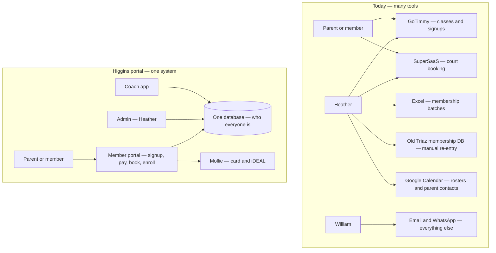

**Talking point for William:** Items 1–4 on his time list (comms, scheduling, firefighting, tech glue) shrink because the **same person record** flows from signup → membership → class → court, instead of being retyped.

**Talking point for Heather:** No more “wait a week, batch Excel, re-enter Triaz DB” for every new member (see membership lifecycle notes in internal process docs).

---

## Slide 3 — Three doors, one building

Everyone signs in with **email** (magic link). The system opens the right “door”:

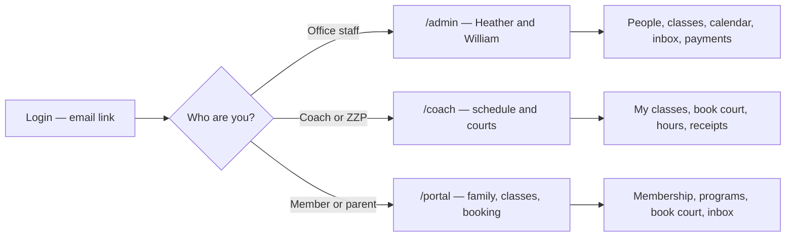

| Door | Who | What they do there |
|------|-----|-------------------|
| **Admin** | Heather (+ William) | Households, memberships, class setup, court calendar, approve requests, refunds |
| **Coach** | Staff + external ZZP coaches | See assigned classes, book courts for lessons, submit hours / invoices |
| **Portal** | Parents and adult members | Buy membership, enroll kids, book play, message inbox, ladder |

---

## Slide 4 — The “things” in the system (no jargon)

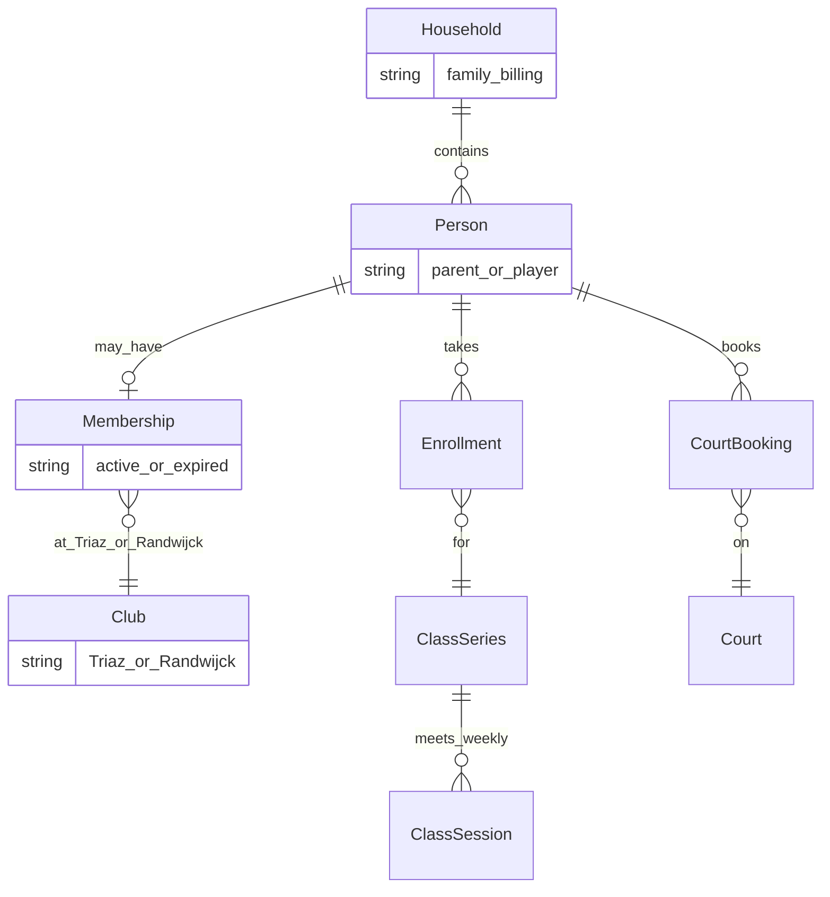

**Plain definitions (say out loud)**

| Term | Meaning |
|------|---------|
| **Household** | One family billing unit (parent + kids, or one adult living alone) |
| **Person** | A human in the system — parent, child, or adult player |
| **Membership** | Right to use a club’s courts (Triaz and/or Randwijck); has start/end dates |
| **Program / class** | A season offering (e.g. Youth Spring, BSA at school) |
| **Enrollment** | “This child is in that class for this season” |
| **Court booking** | A one-hour slot on a specific court |

---

## Slide 5 — Two clubs, two money buckets (William)

Higgins runs **two physical clubs**. Money is separated on purpose:

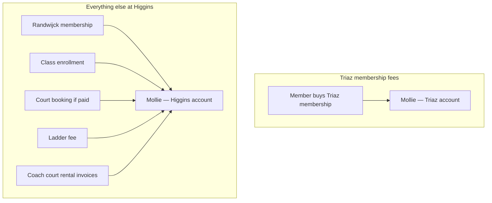

**Joint membership** (both clubs): member pays **two checkouts in a row** — Triaz portion first, then Randwijck — so each legal entity gets the correct payout.

**Note for honesty:** Triaz’s *legal* federation database may still need a periodic export until William decides to automate sync-out.

---

## Slide 6 — Member journey A → Z (parent enrolling a child)

This is the **main “happy path”** for Heather to validate:

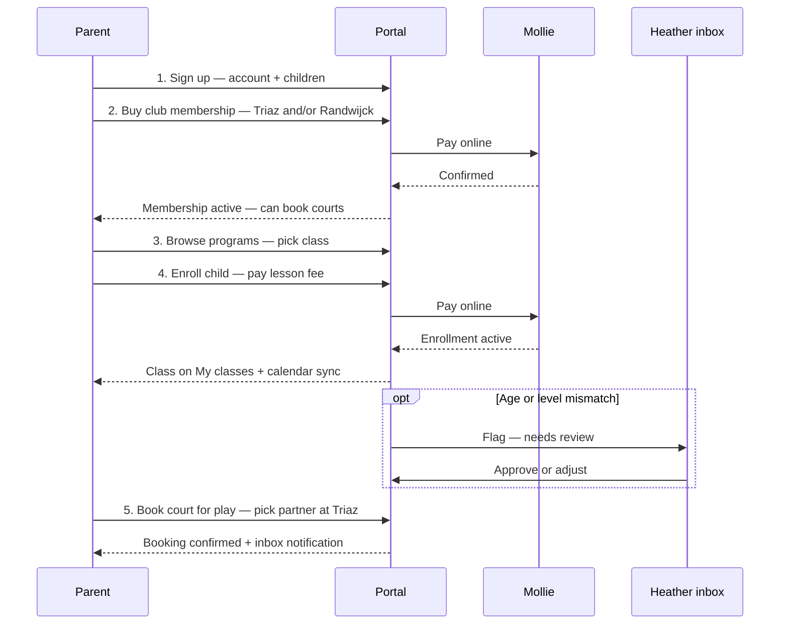

**Triaz rule parents will notice:** when booking for play at Triaz, **partner must be another real member** (not a fake name) — helps the office see who plays together.

---

## Slide 7 — Adult member journey (simpler)

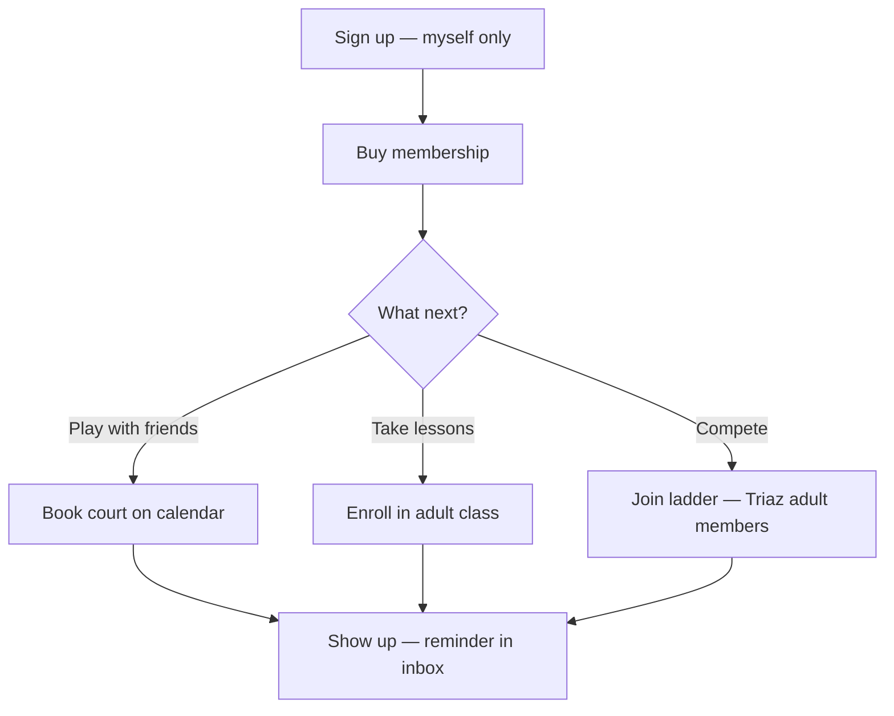

---

## Slide 8 — Heather’s morning (operations dashboard)

What replaces “check GoTimmy, check email, check SuperSaaS”:

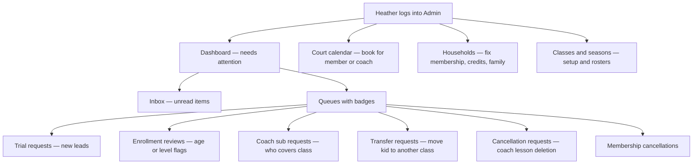

**Heather slide — “your old weekly calendar copy”**

| Old way | New way |
|---------|---------|
| Export roster from GoTimmy, paste parent emails into Google Calendar | Parents/coaches get **calendar feed** from portal (subscribe once) |
| Membership in Excel + manual Triaz DB | **Membership record** created at payment; office edits in Households |
| Court schedule in SuperSaaS | **Same calendar** in portal + admin court view |

---

## Slide 9 — Court booking rules (SuperSaaS replacement)

Matches what SuperSaaS did at Triaz (1 hour slots, one personal booking per day, members only):

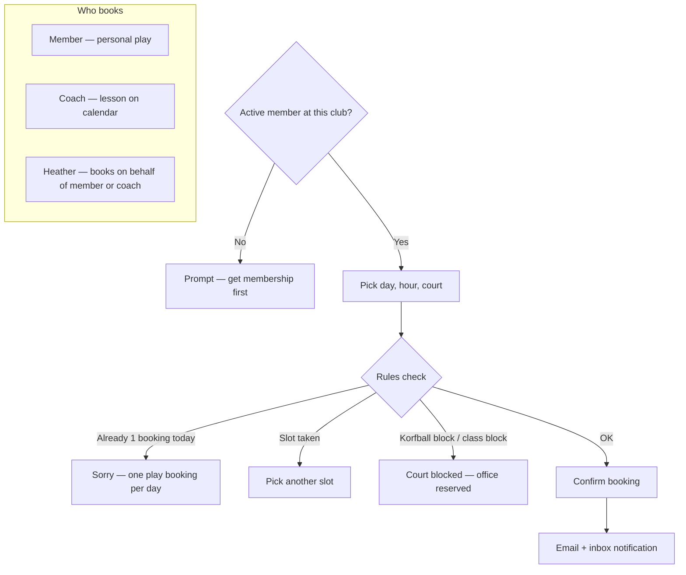

**Randwijck difference:** partner name can be free text (less strict than Triaz).

---

## Slide 10 — Coach workflow

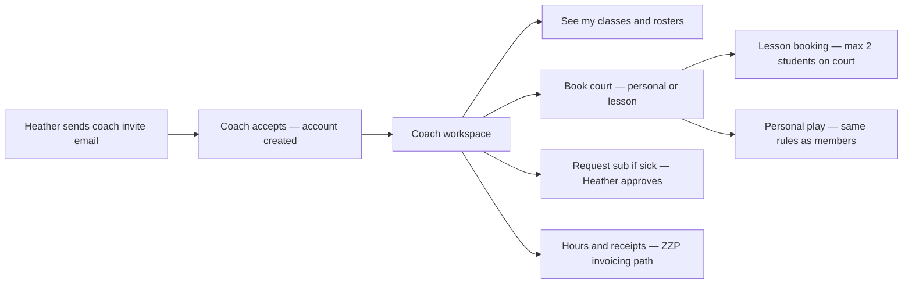

---

## Slide 11 — Class lifecycle (season operations)

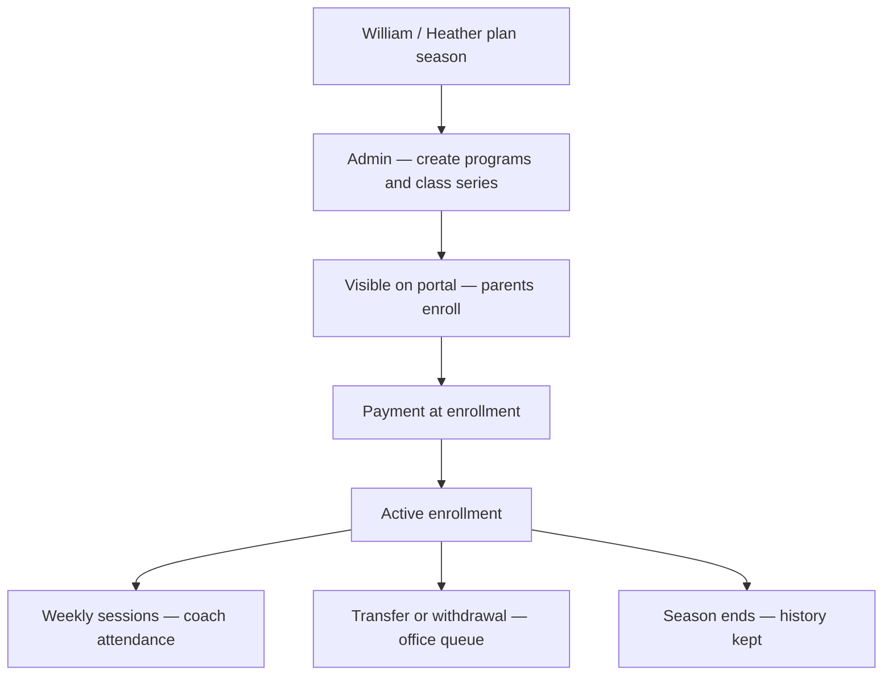

**School programs (BSA, IFS, etc.):** same engine; often **pickup at school** and longer school-year dates — already modeled as delivery modes in the product.

---

## Slide 12 — Events, ladder, trials (secondary flows)

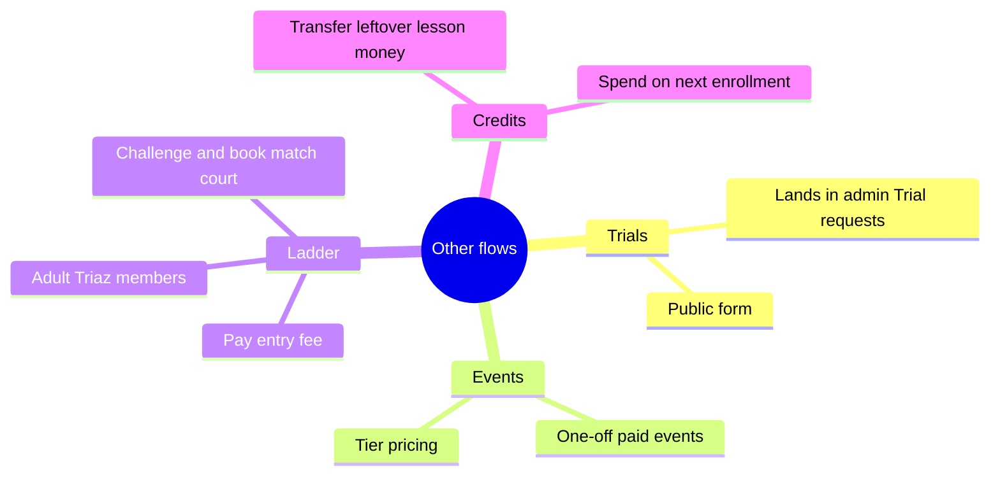

---

## Slide 13 — What still needs William’s side (honest close)

Not hidden from owners — frame as **launch checklist**:

| Topic | Status | William / office action |
|-------|--------|-------------------------|
| Live website URL | Deploy Render/Vercel + env vars | Approve domain |
| Login emails | Supabase + email provider | DNS / SMTP |
| Real payments | Mollie test then live keys | Two Mollie accounts + webhooks |
| Historical customers | Import from old exports optional | Decide cutover date |
| Legal Triaz roster sync | Product is source of truth; federation DB may still need export | Process decision |

---

## Slide 14 — Season calendar (context only)

Annual rhythm from real data — helps William see the product matches how Higgins already thinks:

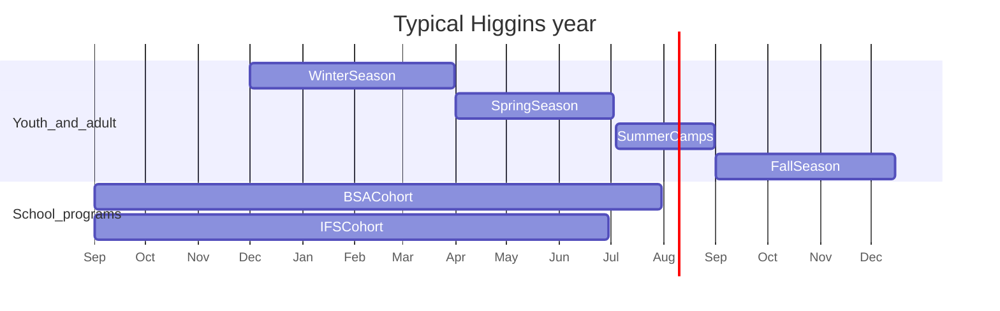

---

## Recommended presentation order (45–60 min)

1. Slide 1–2 — problem and vision (William leads)
2. Slide 3–4 — three doors + vocabulary (both)
3. Slide 6–7 — member journeys (Heather: “does this match the desk?”)
4. Slide 8–9 — Heather daily work + courts (Heather leads)
5. Slide 10–11 — coaches and seasons
6. Slide 5 — money (William, short)
7. Slide 12 — extras only if time
8. Slide 13 — what we need from you to go live
9. **Live demo** — follow [`demo-script-10min.md`](./demo-script-10min.md)

---

## Glossary card (handout)

| They say | System says |
|----------|-------------|
| “Triaz member” | Active membership covering Triaz |
| “Signed up for Spring Red” | Enrollment in a class series |
| “Booked court 3 at 10:00” | Court booking, personal purpose |
| “Private with Coach X” | Court booking, coaching purpose |
| “Family membership” | Household membership tier covering multiple people |
| “Office queue” | Admin inbox + badge counts |
